<table>
<tr>
<td valign="top"></td>
<td valign="top"></td>
</tr>
</table>

## Rajat Rawal

**AI/ML &#183; Generative AI &#183; Open Source Contributor &#183; CS @ DTU**

 

 

 

<table align="center">
<tr>
<td width="50%" valign="top">

### &#128640; Featured Projects

 

**[Digital Twin of Richard Feynman](https://github.com/RajatRawal-06/Digital_Twin_Rag)**
 
Full stack RAG system reconstructing Feynman's intellectual voice. Tri&#8209;retrieval engine with GraphRAG, Qdrant vector DB, and Hybrid MMR. K&#8209;Means memory profiling adapts responses by user expertise level.
 
`Python` `LangChain` `RAG` `FastAPI` `React` `Qdrant`

 

**[Scam&#8209;Sentry](https://github.com/RajatRawal-06/Scam-Sentry)**
 
&#127942; **Grand Finalist** &#183; Thoughtworks Hackathon (Top 25/350+)
 
Privacy&#8209;first browser extension with dual&#8209;layer phishing detection. On&#8209;device Qwen 2.5 LLM via node&#8209;llama&#8209;cpp. Zero data egress, works fully offline.
 
`JavaScript` `Qwen 2.5` `Chrome APIs` `node&#8209;llama&#8209;cpp`

 

**[CrescendoGuard](https://github.com/RajatRawal-06/Crescendo)**
 
Multi&#8209;layer defense framework protecting LLMs against crescendo&#8209;style multi&#8209;turn jailbreak attacks. 10 hazard categories, 7 behavioral signals, 0% attack success rate on test vectors.
 
`Python` `LangChain` `Llama 3.2` `Hugging Face`

</td>
<td width="50%" valign="top">

### &#9889; More Projects

 

**[MACS Unified Compressor](https://github.com/RajatRawal-06/macs-hybrid-compressor)**
 
Chrome Extension + Flask backend with two&#8209;stage hybrid residual compression across Text, Image, Audio, and Video. SHA&#8209;256 verified byte&#8209;perfect reconstruction.
 
`Python` `Flask` `Signal Processing` `SHA&#8209;256`

 

**[AI Autocorrect System](https://github.com/RajatRawal-06/Autocorrect)**
 
Context&#8209;aware autocorrection engine using probabilistic language modelling, N&#8209;gram analysis, and beam search decoding for sentence&#8209;level semantic understanding.
 
`Python` `NLP` `N&#8209;gram Models` `Beam Search`

 

**[MediMap](https://github.com/RajatRawal-06)**
 
AI&#8209;augmented indoor navigation for hospitals. Real&#8209;time crowd density analytics, predictive patient journey modelling, Three.js 3D cartography with Redis&#8209;backed high availability.
 
`React` `Three.js` `Supabase` `Redis`

</td>
</tr>
</table>

 

### &#128736;&#65039; Tech Arsenal

 

**Languages**
 

**AI &#183; ML &#183; Deep Learning**
 

**Generative AI &#183; LLMs**
 

**Frameworks &#183; Tools**
 

**Specializations**
 
`Generative AI` `LLMs` `Transformers` `RAG Pipelines` `Prompt Engineering` `Computer Vision` `NLP` `RLHF` `CNN` `RNN` `LSTM` `GRU` `Autoencoders` `CatBoost` `LightGBM`

 

### &#127891; Certifications

 

Andrew Ng &#183; Neural Networks, CNNs, Sequence Models, Supervised ML, Advanced Algorithms, Reinforcement Learning

 
 

### &#127942; Recognition

<table>
<tr>
<td align="center">
<strong>Grand Finalist</strong> 
Vibe With Singularity Hackathon 
Thoughtworks Gurugram &#183; Top 25 out of 350+ teams &#183; Feb 2026
</td>
<td align="center">
<strong>Open Source Contributor</strong> 
GirlScript Summer of Code 2026 
India's largest open source program &#183; 10,000+ participants
</td>
<td align="center">
<strong>B.Tech CSE</strong> 
Delhi Technological University 
DSA &#183; Machine Learning &#183; Discrete Mathematics &#183; 2025 to 2029
</td>
</tr>
</table>

 

<!-- animated contribution graph, refreshed daily by the workflow -->

 

This README updates itself daily. Built with Python, SMIL animations, and zero external services.

